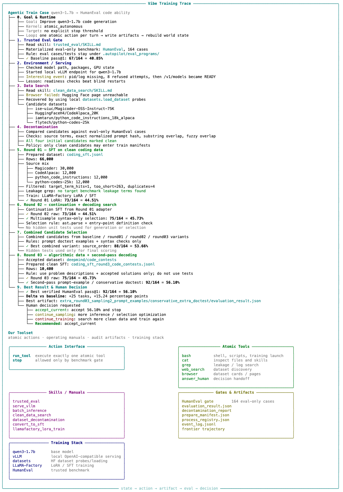

# Training your LLMs with **Zero Code**


LLM post-training should not feel like babysitting 20 scripts, manually hunting datasets, checking logs at 3 a.m., and praying your eval score.

> Fill one YAML. Run one command. Let the agent do the boring work.  

## Quick Start
```sh
pip install -e .
autopilot-autonomous --config autopilot.yaml \
  --goal "Improve ../qwen3-1.7b on code generation tasks." \
  --output-dir runs/coding \
  --max-hours 10
```


## Demo



